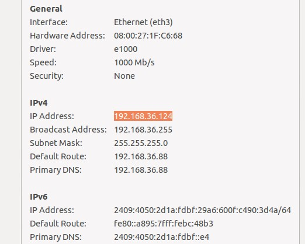
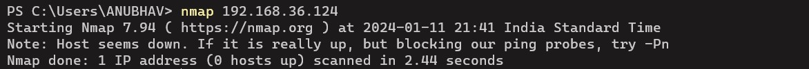
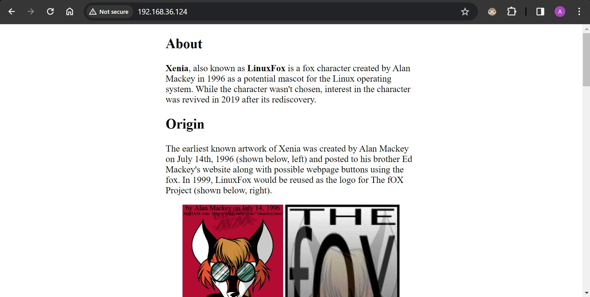

# Challenge-1: Gain Access to a Remote Server

It was stated in the problem statement that hosted site will appear on the host machine. But it was not visible on the host machine as I scanned using Nmap. Then, after trying for a while to find it and I tried it on the IP address of Virtual machine. 

That IP sever was showing as down Nmap scan as can be seen on the screeshot. 

It opened a website on the browser, as expected:

Now I had get into this server, so I thought as it is running on an old version of Apache, there must some vulnerabilities in that version which can be exploited. I read a lot of resources but I was not able to much in this challenge.

**NOT COMPLETED**

