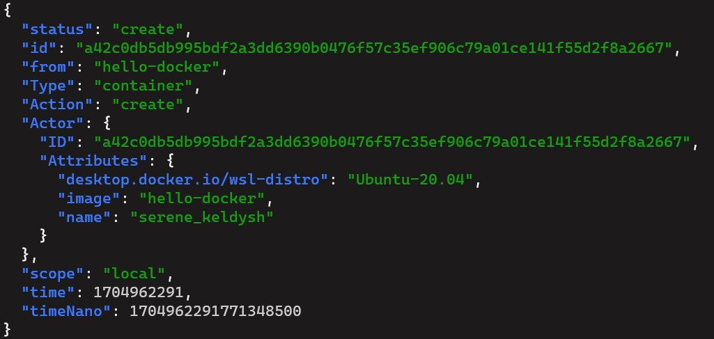
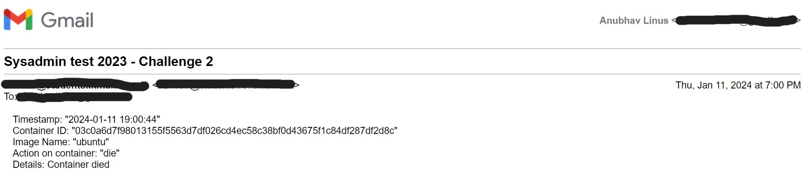

# Challenge-2: Docker and Scripting


At the start of this challenge I literally had no idea what docker is and now I am pretty confident in working with it.  

I watched a [Youtube video](https://www.youtube.com/watch?v=pTFZFxd4hOI&pp=ygUGZG9ja2Vy) to learn what docker is and how does it work. I made a simple docker image of a javascript application and also pulled on image from Dockerhub ([Ubuntu](https://hub.docker.com/_/ubuntu)), and used these images to learn Docker CLI commmands.  

After learning the necesary things to move forward to the challenge, I moved on to the challenge. I searched "How to monitor docker container", but most of the resources which I found were using some third-party tools to monitor. After reading those blogs I realized that I had to use `docker logs` and `docker ps` commmands provided by docker to do it, so tried to use them to monitor containers and I realized that I had to run them again-and-again, as they do not give real-time information. So I explored more options which I can use and I found `docker events` which gives real-time event information. 

I tried to use `docker events` command to see if it can be used and it turns out that it can be. 

## Details of the solution
  
 ***The script once runnning will check every docker event occured on the server in real-time.***
- I have used **bash script** as `docker events` is a CLI command.
- `docker events` outputs many parameters for an event associated with a container and there is parameter `Action` which can be seen using the command `docker events --format '{{json .}}' | jq '.'` in json format [output is in the image below for illustration]. 



We can utilize any of these parameters to monitor events occuring the server. But for this challenge only `Action` parameters works well.

Action can have to following values:
- **attach**: A container is attached to another container.
- **commit**: Changes to a container's file system are committed as a new image.
- **copy**: A file or directory is copied to or from a container.
- **create**: A new container is created.
- **destroy**: A container is destroyed or removed.
- **die**: A container stops or exits.
- **exec_create**: A new exec instance is created.
- **exec_die**: An exec instance stops or exits.
- **export**: A container's file system is exported as a tar archive.
- **kill**: A container is killed.
- **oom**: Out of memory event in a container.
- **pause**: A container is paused.
- **rename**: A container is renamed.
- **resize**: Terminal size of a container is resized.
- **restart**: A container is restarted.
- **start**: A container is started.
- **stop**: A container is stopped.
- **top**: A process is run in a container with the docker top command.
- **unpause**: A container is unpaused.
- **update**: Update of a container's resource constraints.

Using `Action` parameter we can get the action performed with the container, i.e. whether it has been stopped,  killed, destroyed, etc. I have used some of these parameter values as trigger to send email, which I considered to be relevant for this challenge, i.e. `destroy, stop, kill, oom, pause, unpause, die`. 

- To change receiver and sender email address, change value of `RECEIVER_EMAIL` and `SENDER_EMAIL` variable respectively.
- Parameter values which will trigger are stored in an array named `TRIGGER_OUTPUTS=( "destroy" "stop" "kill" "oom" "pause" "unpause" "die" )` in the script. 

- Details related to the action, which will be sent in the email are stored in dictionary named `DETAILS` and details of each action is added seperately. **To add a new action, its respective details has to be added in this dictionary also*

- Contents in email can easily be added using `jq` utility to get parameter values and `echo` command to add into **msg.txt** file whose content is sent in the email.

#### Email Illustration Video: [Click here](https://drive.google.com/drive/folders/16TLg086u2oC4Fvwrpz9C5RuPykFqfh2c?usp=drive_link)

#### Image of the received email sent from the script

 

## STEPS TO USE THE SCRIPT

1. Add execution permission to the file: `sudo chmod +x <script_path>`
2. Setting the smtp server:
    - change to root user: execute `su` or `sudo bash` command
    - change directory: `cd /etc/ssmtp`
    - edit configuration file (**.conf**) file there 
    - Following variables should be set same as shown below:

```bash
mailhub=smtp.gmail.com:587
UseSTARTTLS=YES
AuthUser=******** #sender email id
AuthPass=******** #password 
TLS_CA_File=/etc/pki/tls/certs/ca-bundle.crt
FromLineOverride=YES
```
3. Disable any turned-on Multi-factor authentication and enable "Less secure app access" on your email account. 
4. Make changes in the script, i.e. email addresses, etc.
5. Run the script

***comments are added in script (``monitor_script.sh``) also***