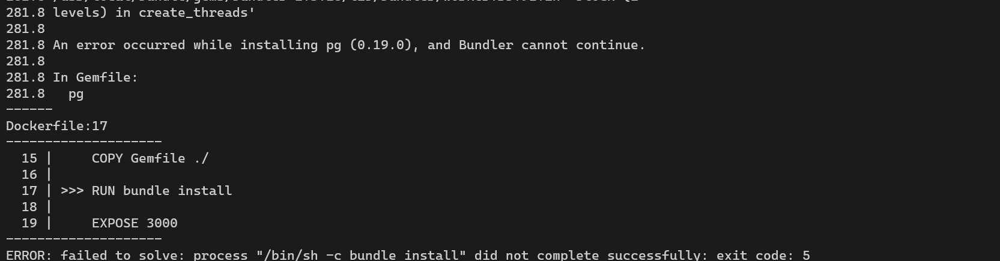

# Challenge-3: Docker Deployment

Deploying application using Docker requires to make Dockerfile which is used to create a docker image with all dependencies included. 

1. **SAIC Website**
    - This website uses HTML, CSS and Javascript and **nginx** image can used as parent image to run these kind of websites. Hence I have used it as parent image.
    Dockerfile content for this application:
    ```Docker
    FROM nginx:alpine
    COPY . /usr/share/nginx/html
    EXPOSE 80
    ```
    Screenshot of building image: 

    Running the image: 

    Accessing webpage on browser: 

    Log of access:  

2. **Github Languages**
    - This website uses Ruby on rails and requires respective dependencies.
    - Current Ruby version is 3 but this application is running on version 2.3.1 which means that it won't work if we use latest version of dependencies. For the same I was faced with error that "*Latest version of Bundler does not work with this verison of Ruby*"
    - On installing older version (2.3.26), error occured. 

Screenshot of the error: 


---


I have created a docker-compose file which will run only one application as I was not able to run the other one. 

**I was not able to complete the backup volume part, whatever I have done is in the `compose.yaml` file in this folder it self**


## STEPS TO RUN

1. Move to the folder which has compose.yaml
2. Run `docker compose up` command
3. It will run application 

